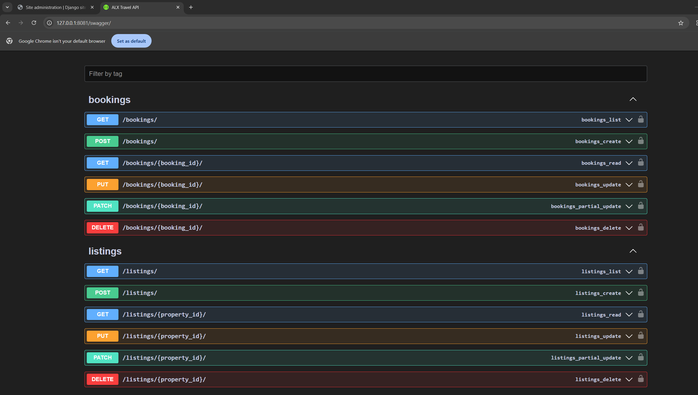

# ALX Travel App

A Django REST API for managing property listings and bookings. This application provides endpoints for creating and managing property listings, handling bookings, and managing reviews.

## Features

- Property Listings Management
- Booking System
- Review System
- User Authentication
- API Documentation with Swagger/ReDoc
- MySQL Database Integration
- Celery Task Queue Integration
- Database Seeding for Development

## Tech Stack

- Python 3.x
- Django 4.x
- Django REST Framework
- MySQL
- Redis (for Celery)
- Swagger/ReDoc for API documentation

## Prerequisites

- Python 3.x
- MySQL
- Redis
- Docker (optional)

## Setup

1. Clone the repository:

```bash
git clone <repository-url>
cd alx_travel_app
```

2. Create a virtual environment and activate it:

```bash
python -m venv venv
source venv/bin/activate  # On Windows: venv\Scripts\activate
```

3. Install dependencies:

```bash
pip install -r requirements.txt
```

4. Set up MySQL database:

```bash
# Using Docker
docker run --name alx_travel_mysql \
    -e MYSQL_ROOT_PASSWORD=rootpassword \
    -e MYSQL_DATABASE=alx_travel_db \
    -e MYSQL_USER=alx_travel_user \
    -e MYSQL_PASSWORD=alx_travel_pass \
    -p 3306:3306 -d mysql:latest
```

5. Create a `.env` file in the project root (use `.env.example` as a template):

```bash
cp .env.example .env
# Edit .env with your configuration
```

6. Run migrations:

```bash
python manage.py migrate
```

7. Create a superuser:

```bash
python manage.py createsuperuser
```

8. (Optional) Seed the database with sample data:

```bash
python manage.py seed
```

This will create:

- 7 sample users (5 regular users, 2 staff users)
- 14 property listings (2 per user)
- Multiple bookings and reviews
  All sample users have the password: `password123`

## Running the Application

1. Start the development server:

```bash
python manage.py runserver
```

2. Start Celery worker (in a separate terminal):

```bash
celery -A alx_travel_app worker -l info
```

## API Endpoints

The API provides the following endpoints:

- `/api/listings/` - Property listings management
- `/api/bookings/` - Booking management
- `/api/reviews/` - Review management
- `/swagger/` - Swagger API documentation
- `/redoc/` - ReDoc API documentation
- `/admin/` - Admin interface
- `/api-auth/` - Authentication endpoints

## Authentication

The API uses Django REST Framework's built-in authentication. To access protected endpoints:

1. Create a user account or use the superuser account
2. Use the login endpoint or session authentication
3. Include authentication credentials in your requests

## API Documentation

The API is fully documented using Swagger/OpenAPI specification. You can explore and test the API endpoints using the interactive documentation.

### Swagger UI



- Swagger UI: `/swagger/`
- ReDoc: `/redoc/`

## Development

1. Make sure to create and activate a virtual environment
2. Install development dependencies
3. Follow PEP 8 style guide
4. Write tests for new features
5. Update documentation as needed

## Testing

Run the test suite:

```bash
python manage.py test
```

## Contributing

1. Fork the repository
2. Create a feature branch
3. Commit your changes
4. Push to the branch
5. Create a Pull Request

## License

This project is licensed under the MIT License - see the LICENSE file for details.

## Background Tasks with Celery

This project uses Celery with RabbitMQ for handling background tasks such as sending email notifications.

### Setting up RabbitMQ

1. Install RabbitMQ:

```bash
sudo apt-get install rabbitmq-server
```

2. Start RabbitMQ service:

```bash
sudo systemctl start rabbitmq-server
sudo systemctl enable rabbitmq-server
```

### Running Celery

1. Start the Celery worker:

```bash
celery -A alx_travel_app worker -l info
```

2. (Optional) Start Celery beat for periodic tasks:

```bash
celery -A alx_travel_app beat -l info
```

### Email Configuration

The application uses SMTP for sending emails. To configure email settings:

1. Copy the email configuration from `.env.example` to your `.env` file
2. Update the email settings with your SMTP credentials
3. For Gmail, you'll need to:
   - Enable 2-factor authentication
   - Generate an App Password
   - Use the App Password as EMAIL_HOST_PASSWORD

### Features

- Asynchronous email notifications for booking confirmations
- Background task processing with Celery
- Email notifications using SMTP

## Docker Setup

You can run the entire application stack using Docker Compose:

1. Create a `.env` file from the template:

```bash
cp .env.example .env
# Edit .env with your configuration
```

2. Build and start the containers:

```bash
docker-compose up --build
```

This will start the following services:

- Django web application (http://localhost:8000)
- MySQL database
- Redis for Celery results backend
- RabbitMQ for message broker
- Celery worker for background tasks

You can access:

- RabbitMQ management interface at http://localhost:15672 (guest/guest)
- Django admin interface at http://localhost:8000/admin
- API documentation at http://localhost:8000/swagger/
- Mailpit web interface at http://localhost:8025

3. Run migrations inside the container:

```bash
docker-compose exec web python manage.py migrate
```

4. Create a superuser:

```bash
docker-compose exec web python manage.py createsuperuser
```

5. (Optional) Seed the database:

```bash
docker-compose exec web python manage.py seed
```

To stop the services:

```bash
docker-compose down
```

To stop the services and remove all data (volumes):

```bash
docker-compose down -v
```

### Email Testing with Mailpit

The application uses Mailpit for email testing in the development environment. When running with Docker Compose:

- SMTP server is available at port 1025
- Web interface to view emails is available at http://localhost:8025
- No authentication required for SMTP
- All emails are caught by Mailpit and won't be actually sent
- You can view HTML and plain text versions of emails
- Supports attachments and different email clients

You can access:

- RabbitMQ management interface at http://localhost:15672 (guest/guest)
- Django admin interface at http://localhost:8000/admin
- API documentation at http://localhost:8000/swagger/
- Mailpit web interface at http://localhost:8025
